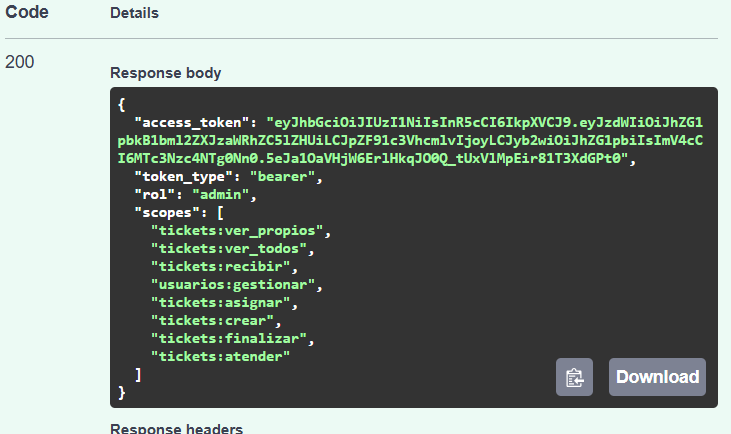
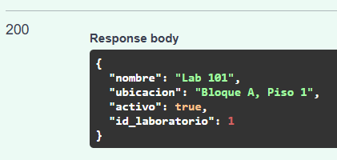
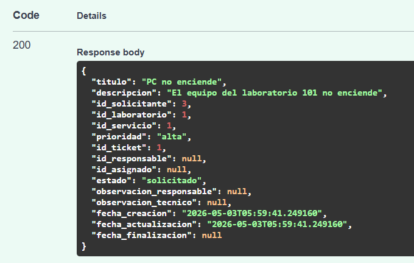

# Aplicaciones-y-servicios-web-2026-taller3
# Taller 3 - Mesa de Servicios con JWT y Scopes


[Guía del Taller](apps_services-Taller-3/Taller3.md)


## API con FastAPI, PostgreSQL, JWT y Scopes


En este taller se desarrolla una API segura para gestionar tickets de servicios en laboratorios universitarios, implementando:


- **Autenticación** con JWT (JSON Web Tokens)
- **Autorización** basada en scopes por rol
- **Flujo de estados** controlado para tickets
- **CRUD completo** para: Usuarios, Laboratorios, Servicios y Tickets


---


## 🧱 Arquitectura del proyecto


La estructura de carpetas del proyecto se organiza de la siguiente forma:


```
apps_services-Taller-3/
│
├── main.py
├── database.py
├── .env
├── api/
├── crud/
├── models/
├── schemas/
├── security/
├── requirements.txt
└── README.md
```


Separando responsabilidades:


- `database.py` → conexión a PostgreSQL
- `models/` → modelos de SQLAlchemy
- `schemas/` → validaciones con Pydantic
- `crud/` → operaciones de base de datos
- `api/` → endpoints de la API
- `security/` → autenticación JWT y verificación de scopes


---


## ⚙️ Instalación


### Ubicarse en la carpeta del proyecto


```bash
cd ruta/del/proyecto
```


### Crear entorno virtual


```bash
python -m venv venv
```


### Activar entorno virtual


```bash
source venv/bin/activate  # Linux/macOS
venv\Scripts\activate     # Windows
```


### Instalar dependencias


```bash
pip install -r requirements.txt
```


---


## 🔐 Configuración archivo .env


Crear un archivo `.env` en la raíz del proyecto:


```env
DATABASE_URL=url de la base de datos a conectar
SCHEMA=schema dado por el profesor(jwt_grupo_12)
SECRET_KEY=""
ALGORITHM="HS256"
ACCESS_TOKEN_EXPIRE_MINUTES=30
```


---


## ▶️ Ejecución


Levantar el servidor con el comando uvicorn:


```bash
uvicorn main:app --reload
```

Ir a la direccion en la cual esta corriendo el servidor con uvicorn
```bash
http://127.0.0.1:8000
```

Despues de verificar que funciona, nos vamos a la url con la documentacion Swagger:

```bash
http://127.0.0.1:8000/docs
```


---


## 🔁 Endpoints disponibles


### Autenticación


```
POST   /auth/token
```


### Usuarios (Solo Admin)


```
POST   /usuarios/
GET    /usuarios/
GET    /usuarios/{id_usuario}
```


### Laboratorios


```
POST   /laboratorios/
GET    /laboratorios/
GET    /laboratorios/{id_laboratorio}
```


### Servicios


```
POST   /servicios/
GET    /servicios/
GET    /servicios/{id_servicio}
```


### Tickets


```
POST   /tickets/
GET    /tickets/
GET    /tickets/{id_ticket}
PATCH  /tickets/{id_ticket}/estado
PATCH  /tickets/{id_ticket}
```


---


## 🔑 Autenticación con JWT


### Paso 1: Obtener token


Ir al endpoint `POST /auth/token` en Swagger, presionar "Try it out" e ingresar(si no, no nos dejara acceder a ningun endpoint):


```json
{
 "correo": "admin@universidad.edu",
 "password": "123456"
}
```

Presionar "Execute" y copiar el `access_token` de la respuesta (string largo que empieza con `eyJ...`).


---


### Paso 2: Autorizar en Swagger


1. Hacer clic en el botón **"Authorize"** (arriba a la derecha)
2. En el campo `HTTPBearer`, pegá **solo el token** 
3. Presionar "Authorize" y luego "Close"


Ahora todos los endpoints protegidos usarán ese token automáticamente.


---


## 🧪 Testing


### Creacion de Usuarios

Las api's de Usuarios solo puede ser gestionado por el **admin**
Aqui podemos crear usuarios, siendo los atributos clave **correo**, **contraseña** y **rol** 

---

📝 Crear Usuarios con cada rol

Los siguientes Json's irian en el body de Crear Usuario, siendo cada Usuario uno con cada rol existente en la app.

1️⃣ Usuario SOLICITANTE

POST /usuarios/:

```
 {
   "nombre": "Juan Estudiante",
   "correo": "juan@estudiante.edu",
   "rol": "solicitante",
   "activo": true,
   "password": "123456"
 }
```

---

2️⃣ Usuario RESPONSABLE_TECNICO

POST /usuarios/:

```
 {
   "nombre": "Maria Responsable",
   "correo": "maria@responsable.edu",
   "rol": "responsable_tecnico",
   "activo": true,
   "password": "123456"
 }
 ```

---

3️⃣ Usuario AUXILIAR

POST /usuarios/:

```
 {
   "nombre": "Pedro Auxiliar",
   "correo": "pedro@auxiliar.edu",
   "rol": "auxiliar",
   "activo": true,
   "password": "123456"
 }
 ```

---

4️⃣ Usuario TECNICO_ESPECIALIZADO

POST /usuarios/:

```
 {
   "nombre": "Carlos Tecnico",
   "correo": "carlos@tecnico.edu",
   "rol": "tecnico_especializado",
   "activo": true,
   "password": "123456"
 }
```

---


### Usuarios para casos de prueba


La API tendria de prueba, los siguientes usuarios:


| Rol | Correo | Contraseña |
|-----|--------|------------|
| `admin` | `admin@universidad.edu` | `123456` |
| `solicitante` | `juan@estudiante.edu` | `123456` |
| `responsable_tecnico` | `maria@responsable.edu` | `123456` |
| `auxiliar` | `pedro@auxiliar.edu` | `123456` |
| `tecnico_especializado` | `carlos@tecnico.edu` | `123456` |


> **Nota:** El usuario admin tuvo que crearse primero.


---


### Crear Laboratorio y Servicio (como admin)


**Laboratorio:**


Ir a `POST /laboratorios/`, presionar "Try it out":


```json
{
 "nombre": "Lab 101",
 "ubicacion": "Bloque A, Piso 1",
 "activo": true
}
```


Anotar el `id_laboratorio` devuelto (ej: `1`).



**Servicio:**


Ir a `POST /servicios/`:


```json
{
 "nombre": "Soporte de Hardware",
 "descripcion": "Reparación de equipos de cómputo",
 "activo": true
}
```


Anotar el `id_servicio` devuelto (ej: `1`).


---


## 📊 Flujo de Estados del Ticket


El estado de un ticket sigue un flujo estrictamente controlado. Solo se permiten las transiciones indicadas:


```
solicitado → recibido → asignado → en_proceso → en_revision → terminado
    ↑            ↑           ↑           ↑            ↑           ↑
    │            │           │           │            │           │
 solicitante  responsable  responsable   auxiliar/    auxiliar/  responsable
              técnico      técnico      técnico      técnico    técnico
```


### Tabla de Transiciones Válidas


| Estado Actual | Estado Siguiente | Scope Requerido |Quién Puede |
|---------------|------------------|-----------------|------------|
| `solicitado` | `recibido` | `tickets:recibir` | responsable_tecnico, admin |
| `recibido` | `asignado` | `tickets:asignar` | responsable_tecnico, admin |
| `asignado` | `en_proceso` | `tickets:atender` | auxiliar/técnico asignado, admin |
| `en_proceso` | `en_revision` | `tickets:atender` | auxiliar/técnico asignado, admin |
| `en_revision` | `terminado` | `tickets:finalizar` | responsable_tecnico, admin |


> **Importante:** Cualquier intento de transición fuera de esta tabla será rechazado con **HTTP 422** (transición no permitida).


---


### Caso 1: Solicitante crea ticket


1. **Iniciar sesión como solicitante:**
  - `POST /auth/token` con `juan@estudiante.edu` / `123456`
```json
{
 "correo": "juan@estudiante.edu",
 "password": "123456"
}
```
  - Copiar el token
  - Botón "Authorize" → pegar token → Authorize → Close


2. **Crear ticket:**
  - Ir a `POST /tickets/`
  - Presionar "Try it out"
  - Ingresar body:
  ```json
  {
   "titulo": "PC no enciende",
   "descripcion": "El equipo del laboratorio 101 no enciende",
   "id_solicitante": 3,
   "id_laboratorio": 1,
   "id_servicio": 1,
   "prioridad": "alta"
  }
  ```
  - Presionar "Execute"





> **Resultado esperado:** ✅ Código 200 - Ticket creado exitosamente


---


### Caso 2: Ver tickets creados


Ir a `GET /tickets/`, presionar "Try it out" y "Execute":


> **Resultado esperado:** ✅ Código 200 - Lista de tickets (cada usuario ve solo los suyos, admin ve todos. En este caso el usuario veria el ticket que acabo de crear)


---


### Caso 3: Responsable técnico recibe ticket


1. **Iniciar sesión como responsable_tecnico:**
  - `POST /auth/token` con `maria@responsable.edu` / `123456`
```json
{
 "correo": "maria@responsable.edu",
 "password": "123456"
}
```
  - Autorizar en Swagger con el nuevo token


2. **Cambiar estado del ticket:**
  - Ir a `PATCH /tickets/{id_ticket}/estado`
  - Ingresar el `id_ticket` creado (ej: `1`)
  - Body:
  ```json
  {
   "estado": "recibido"
  }
  ```
  - Presionar "Execute"


> **Resultado esperado:** ✅ Código 200 - Estado actualizado a "recibido"


---


### Caso 4: Responsable técnico asigna ticket


1. **Mismo usuario (responsable_tecnico)**


2. **Asignar ticket a un auxiliar:**
  - Ir a `PATCH /tickets/{id_ticket}`
  - Ingresar el `id_ticket` creado (ej: `1`)
  - Body:
  ```json
  {
   "id_asignado": 5
  }
  ```
  - Presionar "Execute"


> **Resultado esperado:** ✅ Código 200 - Ticket asignado al auxiliar (Pedro Auxiliar, id=5)


- Ir a `PATCH /tickets/{id_ticket}/estado`
- Ingresar el `id_ticket` creado (ej: `1`)
- Body:
```json
{
    "estado": "asignado"
}
```
- Presionar "Execute"

> **Resultado esperado:** ✅ Código 200 - Estado actualizado a "asignado" para que el Auxiliar pueda operar con el ticket


---


### Caso 5: Auxiliar atiende ticket


1. **Iniciar sesión como auxiliar:**
  - `POST /auth/token` con `pedro@auxiliar.edu` / `123456`
```json
{
 "correo": "pedro@auxiliar.edu",
 "password": "123456"
}
```
  - Autorizar en Swagger


2. **Cambiar estado a "en_proceso":**
  - Ir a `PATCH /tickets/{id_ticket}/estado`
  - Body:
  ```json
  {
   "estado": "en_proceso"
  }
  ```


> **Resultado esperado:** ✅ Código 200 - Estado actualizado (solo funciona si el auxiliar es el asignado)


---


### Caso 6: Auxiliar NO puede finalizar ticket


1. **Mismo usuario (auxiliar)**


2. **Intentar finalizar:**
  - Ir a `PATCH /tickets/{id_ticket}/estado`
  - Body:
  ```json
  {
   "estado": "terminado"
  }
  ```


> **Resultado esperado:** ❌ Código 422 - Transición no permitida


---


### Caso 7: Transición inválida


1. **Iniciar sesión como responsable_tecnico**


2. **Intentar salto inválido (solicitado → terminado):**
  - Ir a `PATCH /tickets/{id_ticket}/estado`
  - Body:
  ```json
  {
   "estado": "terminado"
  }
  ```


> **Resultado esperado:** ❌ Código 422 - Transición no permitida


---


## 🚫 Validaciones de seguridad


### Usuario sin autenticar


Intentar acceder a `GET /usuarios/` sin token:


> **Resultado esperado:** ❌ Código 401 - No autenticado


---


### Usuario sin scope requerido


1. Iniciar sesión como `solicitante`
2. Intentar `GET /usuarios/`


> **Resultado esperado:** ❌ Código 403 - No tiene permisos (scope `usuarios:gestionar` es solo para admin)


---


## ✅ Scopes por rol


| Scope | solicitante | responsable_tecnico | auxiliar | tecnico_especializado | admin |
|-------|-------------|---------------------|----------|----------------------|-------|
| `tickets:crear` | ✅ | ❌ | ❌ | ❌ | ✅ |
| `tickets:ver_propios` | ✅ | ✅ | ✅ | ✅ | ✅ |
| `tickets:ver_todos` | ❌ | ❌ | ❌ | ❌ | ✅ |
| `tickets:recibir` | ❌ | ✅ | ❌ | ❌ | ✅ |
| `tickets:asignar` | ❌ | ✅ | ❌ | ❌ | ✅ |
| `tickets:atender` | ❌ | ❌ | ✅ | ✅ | ✅ |
| `tickets:finalizar` | ❌ | ✅ | ❌ | ❌ | ✅ |
| `usuarios:gestionar` | ❌ | ❌ | ❌ | ❌ | ✅ |

