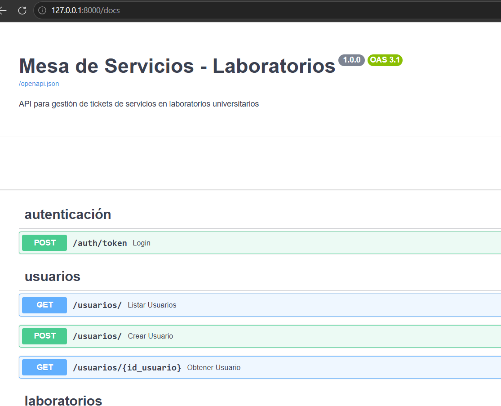

# Aplicaciones-y-servicios-web-2026-taller3
# Taller 3 - Mesa de Servicios con JWT y Scopes


[Guía del Taller](apps_services-Taller-3/Taller3.md)


## API con FastAPI, PostgreSQL, JWT y Scopes


En este taller se desarrolla una API segura para gestionar tickets de servicios en laboratorios universitarios, implementando:


- **Autenticación** con JWT (JSON Web Tokens)
- **Autorización** basada en scopes por rol
- **Flujo de estados** controlado para tickets
- **CRUD completo** para: Usuarios, Laboratorios, Servicios y Tickets


---


## 🧱 Arquitectura del proyecto


La estructura de carpetas del proyecto se organiza de la siguiente forma:


```
apps_services-Taller-3/
│
├── main.py
├── database.py
├── .env
├── api/
├── crud/
├── models/
├── schemas/
├── security/
├── requirements.txt
└── README.md
```


Separando responsabilidades:


- `database.py` → conexión a PostgreSQL
- `models/` → modelos de SQLAlchemy
- `schemas/` → validaciones con Pydantic
- `crud/` → operaciones de base de datos
- `api/` → endpoints de la API
- `security/` → autenticación JWT y verificación de scopes


---


## ⚙️ Instalación


### Ubicarse en la carpeta del proyecto


```bash
cd ruta/del/proyecto
```


### Crear entorno virtual


```bash
python -m venv venv
```


### Activar entorno virtual


```bash
source venv/bin/activate  # Linux/macOS
venv\Scripts\activate     # Windows
```


### Instalar dependencias


```bash
pip install -r requirements.txt
```


---


## 🔐 Configuración archivo .env


Crear un archivo `.env` en la raíz del proyecto:


```env
DATABASE_URL=url de la base de datos a conectar
SCHEMA=schema dado por el profesor(jwt_grupo_12)
SECRET_KEY=""
ALGORITHM="HS256"
ACCESS_TOKEN_EXPIRE_MINUTES=30
```


---


## ▶️ Ejecución


Levantar el servidor con el comando uvicorn:


```bash
uvicorn main:app --reload
```

Ir a la direccion en la cual esta corriendo el servidor con uvicorn
```bash
http://127.0.0.1:8000
```

Despues de verificar que funciona, nos vamos a la url con la documentacion Swagger:

```bash
http://127.0.0.1:8000/docs
```



---


## 🔁 Endpoints disponibles


### Autenticación


```
POST   /auth/token
```


### Usuarios (Solo Admin)


```
POST   /usuarios/
GET    /usuarios/
GET    /usuarios/{id_usuario}
```


### Laboratorios


```
POST   /laboratorios/
GET    /laboratorios/
GET    /laboratorios/{id_laboratorio}
```


### Servicios


```
POST   /servicios/
GET    /servicios/
GET    /servicios/{id_servicio}
```


### Tickets


```
POST   /tickets/
GET    /tickets/
GET    /tickets/{id_ticket}
PATCH  /tickets/{id_ticket}/estado
PATCH  /tickets/{id_ticket}
```


---


## 🔑 Autenticación con JWT


### Paso 1: Obtener token


Ir al endpoint `POST /auth/token` en Swagger, presionar "Try it out" e ingresar:


```json
{
 "correo": "admin@universidad.edu",
 "password": "123456"
}
```
> si no, no nos dejara acceder a ningun endpoint


Presionar "Execute" y copiar el `access_token` de la respuesta (string largo que empieza con `eyJ...`).


---


### Paso 2: Autorizar en Swagger


1. Hacé clic en el botón **"Authorize"** (arriba a la derecha)
2. En el campo `HTTPBearer`, pegá **solo el token** (sin la palabra "Bearer")
3. Presionar "Authorize" y luego "Close"

